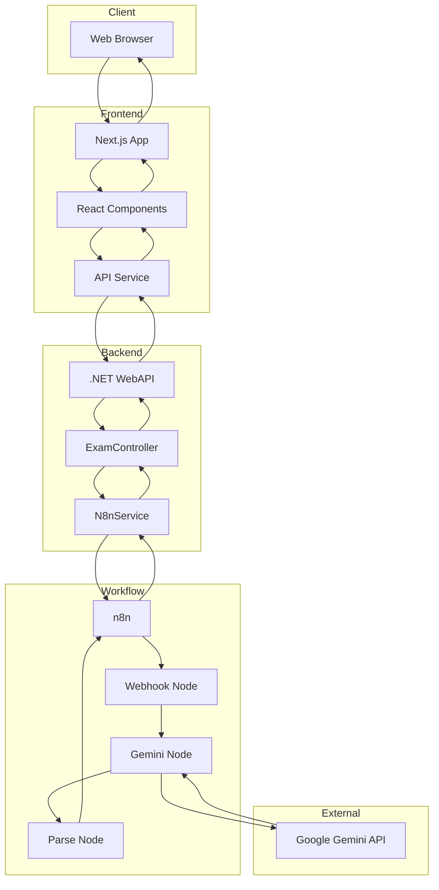
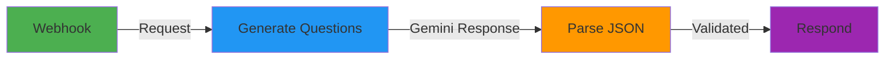
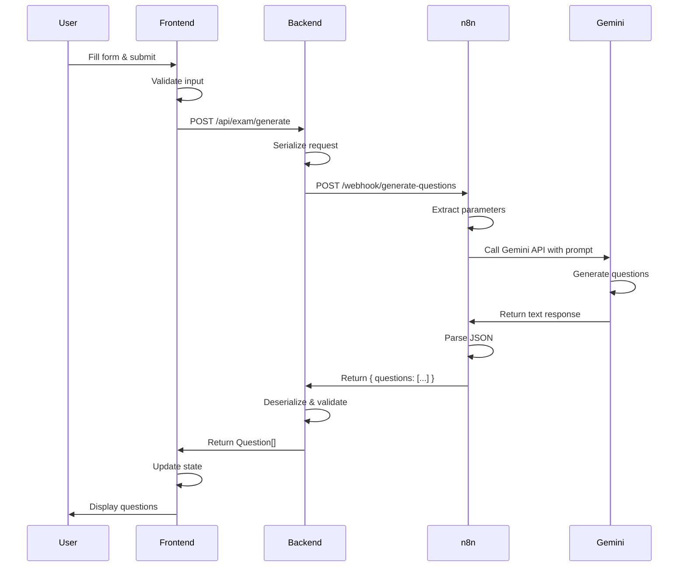
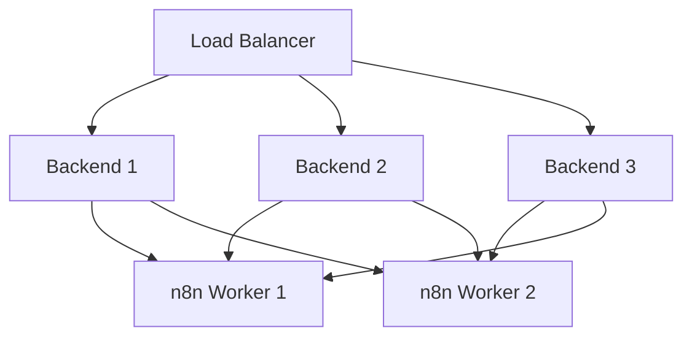
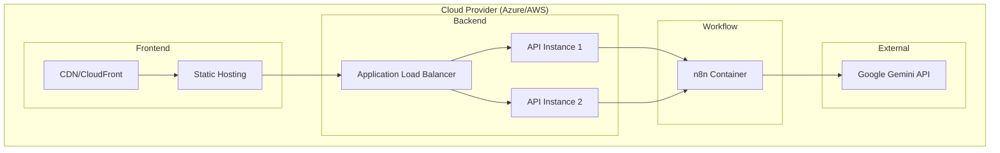

# System Architecture - ExamAI

## 🏗️ High-Level Architecture



---

## 📦 Component Details

### Frontend Layer (Next.js)

**Technology Stack:**
- **Framework**: Next.js 15 (App Router)
- **Language**: TypeScript
- **Styling**: TailwindCSS
- **State Management**: React Hooks (useState)

**Key Components:**

#### 1. TopicForm Component
```typescript
// Location: frontend/components/TopicForm.tsx
Purpose: User input form for exam generation
Responsibilities:
- Collect topic, quantity, difficulty
- Validate input
- Call API service
- Display loading state
```

#### 2. QuestionCard Component
```typescript
// Location: frontend/components/QuestionCard.tsx
Purpose: Display individual questions
Responsibilities:
- Render question text
- Display options as radio buttons
- Show correct answer when revealed
- Display explanation
```

#### 3. API Service
```typescript
// Location: frontend/services/api.ts
Purpose: HTTP client for backend
Responsibilities:
- POST /api/exam/generate
- Error handling
- Response parsing
```

**Data Flow:**
```
User Input → Form Validation → API Call → Loading State → Display Results
```

---

### Backend Layer (.NET)

**Technology Stack:**
- **Framework**: ASP.NET Core 8
- **Language**: C# 12
- **Web Server**: Kestrel
- **Serialization**: System.Text.Json

**Architecture Pattern:** Service-Oriented Architecture (SOA)

#### 1. Controller Layer
```csharp
// Location: backend/Controllers/ExamController.cs
Responsibility: HTTP Request handling
```

**Endpoints:**
| Method | Route | Purpose |
|--------|-------|---------|
| POST | `/api/exam/generate` | Generate exam questions |

#### 2. Service Layer
```csharp
// Location: backend/Services/N8nService.cs
Responsibility: Business logic and n8n communication
```

**Methods:**
| Method | Purpose |
|--------|---------|
| `GenerateQuestionsAsync()` | Call n8n webhook and parse response |

**HTTP Client Configuration:**
```csharp
services.AddHttpClient<IN8nService, N8nService>(client =>
{
    client.Timeout = TimeSpan.FromSeconds(60);
});
```

#### 3. Model Layer
```csharp
// Location: backend/Models/ExamModels.cs
Classes:
- ExamRequest: Input DTO
- Question: Output DTO
```

---

### Workflow Layer (n8n)

**n8n Workflow Nodes:**



#### Node 1: Webhook
- **Type**: HTTP Trigger
- **Method**: POST
- **Path**: `/webhook/generate-questions`
- **Input**: `{ topic, numberOfQuestions, difficulty }`

#### Node 2: Generate Questions (Google Gemini)
- **Type**: AI Model
- **Model**: gemini-2.5-pro
- **Parameters**:
  - Temperature: 0 (deterministic)
  - TopP: 0.1 (precision)
  - TopK: 1 (most probable)
- **Prompt**: Dynamic template with few-shot examples

#### Node 3: Parse JSON
- **Type**: Code (JavaScript)
- **Purpose**: 
  - Extract text from Gemini response
  - Remove markdown fences
  - Parse and validate JSON
  - Format for webhook response

#### Node 4: Respond to Webhook
- **Type**: HTTP Response
- **Format**: `{ questions: [...] }`

---

## 🔄 Data Flow Diagram

### Complete Request Flow



**Timing Breakdown:**
1. User Input → Frontend: < 1ms
2. Frontend → Backend: 50-100ms
3. Backend → n8n: 20-50ms
4. n8n → Gemini: 50-100ms
5. Gemini Processing: 2-10 seconds (varies by question count)
6. Response path: 100-200ms
7. **Total**: 3-15 seconds

---

## 🗄️ Data Models

### Request Model (Frontend → Backend)
```typescript
interface ExamRequest {
  topic: string;          // 1-200 characters
  numberOfQuestions: number; // 1-20
  difficulty: 'Easy' | 'Medium' | 'Hard';
}
```

### Question Model (Backend → Frontend)
```typescript
interface Question {
  id: number;
  text: string;
  options: string[];      // Always 4 options
  correctAnswer: string;  // Must match one option
  explanation: string;
}
```

### Workflow Data (n8n Internal)
```json
{
  "body": {
    "topic": "World History",
    "numberOfQuestions": 5,
    "difficulty": "Easy"
  }
}
```

### Gemini Response (Raw)
```json
{
  "content": {
    "parts": [
      {
        "text": "[{\"id\":1,\"text \":\"...\",\"options\":[...],\"correctAnswer\":\"...\",\"explanation\":\"...\"}]"
      }
    ]
  }
}
```

---

## 🔒 Security Architecture

### Frontend Security
- **XSS Prevention**: React auto-escaping
- **CSRF**: Not applicable (stateless API)
- **Input Validation**: Client-side validation before API call

### Backend Security
- **CORS**: Configured for localhost:3000
- **Input Validation**: Model binding validation
- **Error Handling**: Sanitized error messages (no stack traces in production)

### n8n Security
- **API Key Storage**: n8n credentials manager
- **Webhook Security**: Consider adding authentication header
- **Rate Limiting**: Configure in n8n or reverse proxy

### External Services
- **Gemini API**: API key in environment variables
- **HTTPS**: Use in production for all external calls

---

## 📊 Scalability Considerations

### Current Limitations
- **Concurrent Requests**: Limited by n8n single-thread execution
- **Rate Limits**: Google Gemini API quotas
- **No Caching**: Every request hits Gemini

### Scaling Strategy

#### Horizontal Scaling


#### Caching Layer
```
Frontend → Backend → Redis Cache → n8n → Gemini
                        ↓
                   [Cache Hit: Return cached questions]
```

**Recommended Caching Strategy:**
- **Key**: `hash(topic + numberOfQuestions + difficulty)`
- **TTL**: 24 hours
- **Cache**: Redis or in-memory cache

---

## 🔧 Configuration Management

### Environment-Specific Configs

| Environment | Frontend | Backend | n8n |
|-------------|----------|---------|-----|
| **Development** | localhost:3000 | localhost:5000 | localhost:5678 |
| **Production** | example.com | api.example.com | n8n.example.com |

### Configuration Files

**Frontend:**
```
.env.local          # Local development
.env.production     # Production build
```

**Backend:**
```
appsettings.json            # Default
appsettings.Development.json # Dev overrides
appsettings.Production.json  # Prod settings
```

**n8n:**
```
docker/.env         # Docker Compose environment
```

---

## 📈 Monitoring & Logging

### Recommended Monitoring

**Frontend:**
- **Tool**: Vercel Analytics or Google Analytics
- **Metrics**: Page load time, API call success rate

**Backend:**
- **Tool**: Application Insights or Seq
- **Metrics**: Request duration, error rate, n8n call latency

**n8n:**
- **Built-in**: Execution history in UI
- **External**: Prometheus + Grafana

### Logging Structure

```csharp
// Backend logging
logger.LogInformation("Generating {Count} questions for topic: {Topic}", 
    request.NumberOfQuestions, 
    request.Topic);

logger.LogError(ex, "Failed to call n8n webhook: {Url}", webhookUrl);
```

---

## 🚀 Deployment Architecture

### Recommended Production Setup



---

## 📚 References

- [Setup Guide](./SETUP.md)
- [API Documentation](./API.md)
- [Workflow Guide](./WORKFLOW.md)
- [Troubleshooting](./TROUBLESHOOTING.md)
