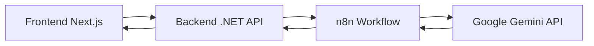

# ExamAI - AI-Powered Exam Question Generator

## 📖 Tổng quan

ExamAI là hệ thống tự động tạo câu hỏi thi trắc nghiệm sử dụng AI (Google Gemini) thông qua n8n workflow. Hệ thống cho phép tạo câu hỏi dựa trên chủ đề, số lượng và độ khó được chỉ định.

## 🏗️ Kiến trúc hệ thống



### Components

- **Frontend**: Next.js + TypeScript + TailwindCSS
- **Backend**: ASP.NET Core Web API (.NET 8)
- **Workflow Engine**: n8n
- **AI Model**: Google Gemini 2.5 Pro
- **Containerization**: Docker & Docker Compose

## 🚀 Tính năng chính

- ✅ Tạo câu hỏi trắc nghiệm tự động bằng AI
- ✅ Hỗ trợ nhiều chủ đề khác nhau
- ✅ Tùy chỉnh số lượng câu hỏi
- ✅ 3 mức độ khó: Easy, Medium, Hard
- ✅ Tích hợp n8n workflow để quản lý AI processing
- ✅ RESTful API
- ✅ Responsive UI

## 📦 Cấu trúc Project

```
exam_ai/
├── backend/              # .NET Web API
│   ├── Controllers/      # API Controllers
│   ├── Services/         # Business Logic
│   ├── Models/           # Data Models
│   └── Program.cs        # Entry point
├── frontend/             # Next.js Application
│   ├── app/              # App Router
│   ├── components/       # React Components
│   ├── services/         # API Services
│   └── types/            # TypeScript Types
├── n8n/                  # n8n Workflow
│   └── workflow.json     # Workflow definition
├── docker/               # Docker Configuration
│   └── compose.yml       # Docker Compose file
└── docs/                 # Documentation
    ├── README.md         # This file
    ├── SETUP.md          # Setup Guide
    ├── API.md            # API Documentation
    ├── WORKFLOW.md       # n8n Workflow Guide
    └── TROUBLESHOOTING.md # Common Issues
```

## 🔗 Quick Links

- [Setup Guide](./SETUP.md) - Hướng dẫn cài đặt và chạy project
- [API Documentation](./API.md) - API endpoints và usage
- [Workflow Guide](./WORKFLOW.md) - n8n workflow configuration
- [Troubleshooting](./TROUBLESHOOTING.md) - Xử lý lỗi thường gặp

## 📋 Prerequisites

- .NET 8 SDK
- Node.js 18+
- Docker & Docker Compose
- n8n instance
- Google Gemini API Key

## ⚡ Quick Start

```bash
# 1. Clone repository
git clone https://github.com/CoderSaiya/exam_ai.git
cd exam_ai

# 2. Setup environment variables
cp docker/.env.example docker/.env
# Edit docker/.env with your API keys

# 3. Start with Docker Compose
cd docker
docker compose up -d

# 4. Import n8n workflow
# - Access n8n at http://localhost:5678
# - Import n8n/workflow.json
```

Xem [SETUP.md](./SETUP.md) để biết chi tiết.

## 🎯 Use Cases

### 1. Giáo viên tạo đề thi
```json
POST /api/exam/generate
{
  "topic": "Lịch sử Việt Nam",
  "numberOfQuestions": 10,
  "difficulty": "Medium"
}
```

### 2. Học sinh tự luyện tập
```json
POST /api/exam/generate
{
  "topic": "Python Programming",
  "numberOfQuestions": 20,
  "difficulty": "Easy"
}
```

## 🛠️ Technology Stack

### Frontend
- **Framework**: Next.js 15
- **Language**: TypeScript
- **Styling**: TailwindCSS
- **HTTP Client**: Fetch API

### Backend
- **Framework**: ASP.NET Core 8
- **Language**: C# 12
- **Serialization**: System.Text.Json

### AI & Workflow
- **AI Model**: Google Gemini 2.5 Pro
- **Workflow**: n8n
- **Parameters**: 
  - Temperature: 0 (deterministic)
  - TopP: 0.1
  - TopK: 1

## 📊 Performance

- **Response Time**: ~5-10s (depending on number of questions)
- **Max Questions per Request**: 20
- **Supported Topics**: Unlimited
- **Concurrent Requests**: Depends on n8n configuration

## 🔒 Security

- CORS configuration for frontend
- API error handling
- Input validation
- Environment variable for sensitive data

## 🤝 Contributing

Xem [CONTRIBUTING.md](./CONTRIBUTING.md) để biết cách đóng góp.

## 📝 License

MIT License - xem [LICENSE](../LICENSE) để biết chi tiết.

## 👥 Authors

- **CoderSaiya** - [GitHub](https://github.com/CoderSaiya)

## 📞 Support

- **Issues**: [GitHub Issues](https://github.com/CoderSaiya/exam_ai/issues)
- **Discussions**: [GitHub Discussions](https://github.com/CoderSaiya/exam_ai/discussions)
